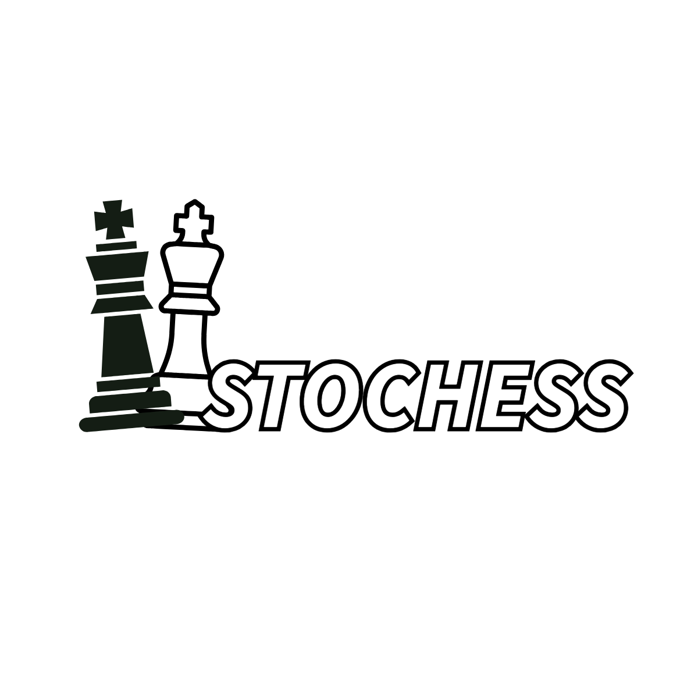

# StoChess Game (Chess Engine)

StoChess is almost fully functional simple chess game with an AI opponent based on the Stockfish engine.


## Table of Contents
- [Installation](#installation)
- [Usage](#usage)
- [Feedback](#feedback)
- [License](#license)
- 
## Installation
To install StoChess, follow these steps:
1. Clone this repo;
2. Install the necessary Python modules using pip:

   ```bash
   pip install -r requirements.txt

## Usage
To use this project, follow these steps:
1. Clone this repo;
2. Simply open Stochess.exe file and you will be able to use it.

## Feedback
Feel free to reach out if you find any bugs and/or have an improvement proposal.
*email: ldzotsenidze4@gmail.com*


## License
This project is licensed under the [MIT License](LICENSE).

***I will try to update this engine and make it more like modern chess-like engines are.***
